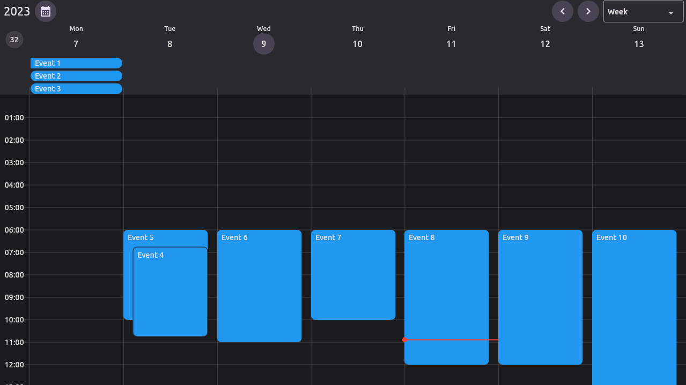
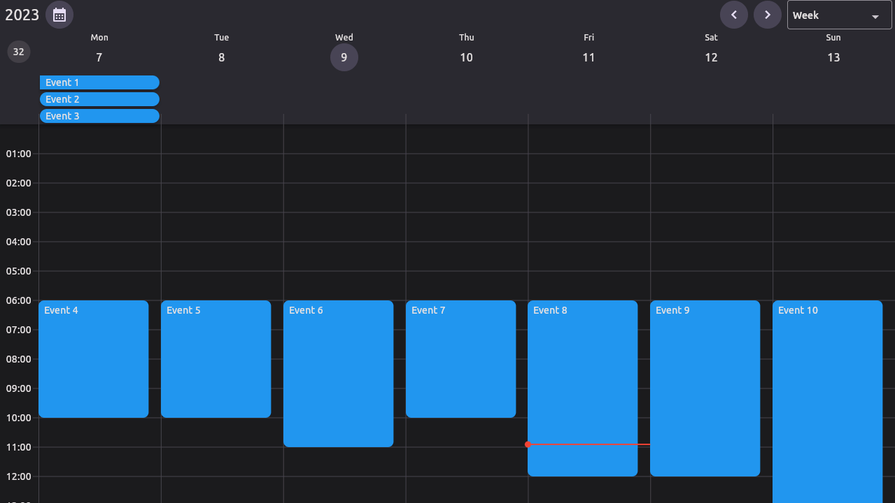

<!--
This README describes the package. If you publish this package to pub.dev,
this README's contents appear on the landing page for your package.

For information about how to write a good package README, see the guide for
[writing package pages](https://dart.dev/guides/libraries/writing-package-pages).

For general information about developing packages, see the Dart guide for
[creating packages](https://dart.dev/guides/libraries/create-library-packages)
and the Flutter guide for
[developing packages and plugins](https://flutter.dev/developing-packages).
-->

<!--
This README describes the package. If you publish this package to pub.dev,
this README's contents appear on the landing page for your package.

For information about how to write a good package README, see the guide for
[writing package pages](https://dart.dev/guides/libraries/writing-package-pages).

For general information about developing packages, see the Dart guide for
[creating packages](https://dart.dev/guides/libraries/create-library-packages)
and the Flutter guide for
[developing packages and plugins](https://flutter.dev/developing-packages).
-->

A Flutter package allows you to use a Calendar Widget that has built-in Day, MultiDay, and Month views. 
It also allows you to customize the appearance of the calendar widget.


## Features

<!--TODO: List what your package can do. Maybe include images, gifs, or videos.-->

* Calendar Views - There is 3 calendar views available, Day, MultiDay, and Month.
  (desktop)
  (mobile)

* Custom Object - CaledarEvent's can store any object and can be accessed in the builder functions.
    ```dart 
    CalendarEvent<CustomObject>(
      eventData: CustomObject(),
    )
    ```


* Drag and Drop - Drag and drop events to different days.
     (move and resize)

* Resize - Resize events by dragging the bottom of the event.
     (resize)

* Flexible View's - 

* First Day of the Week - 

* Appearance -

* Custom Builders - 


## Installation

1. Add this to your package's pubspec.yaml file:
    
    ```
   $ flutter pub add kalender
    ```
2. Import it:   
    
    ```dart
   import 'package:kalender/kalender.dart';
    ```

## Usage

1. Create a custom class to store your data. 
    ```dart
    class Event {
      final String title;
      final Color color;
    
      Event(this.title, this.description);
    }
    ```

2. Create a EventsController
    ```dart
    final eventsController = EventsController<Event>();
    ```
    Add events to the controller
    ```dart
    eventsController.addEvent(
      CalendarEvent(
        dateTimeRange: DateTimeRange()
        eventData: Event(  
            title: 'Event 1',
            color: Colors.blue,
        ),
      ),
    );
    ```

3. Create a CalendarController
    ```dart
    final calendarController = CalendarController();
    ```

4. Create a CalendarView
    ```dart
    CalendarView(
      eventsController: eventsController,
      calendarController: calendarController,
      tileBuilder: _tileBuilder(),
      multiDayTileBuilder: _multiDayTileBuilder(),
      monthTileBuilder: _monthEventTileBuilder(),
    )       
    ```
    


## Additional information


<!-- TODO: Add more info -->